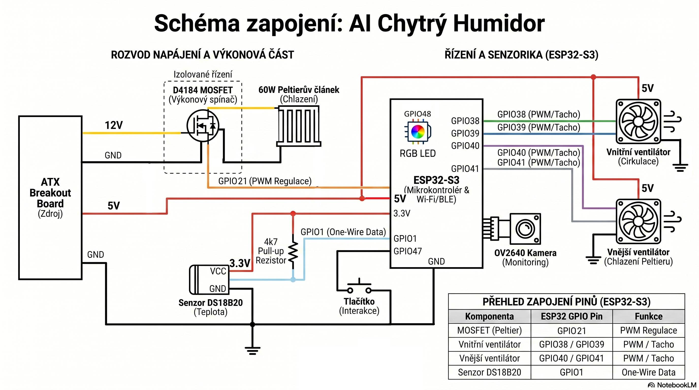
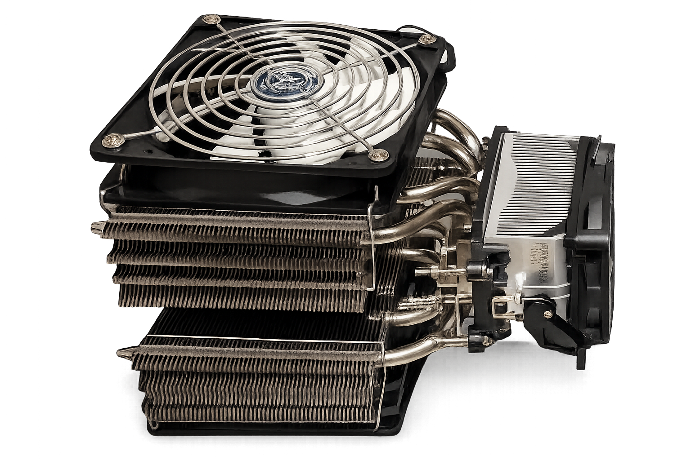
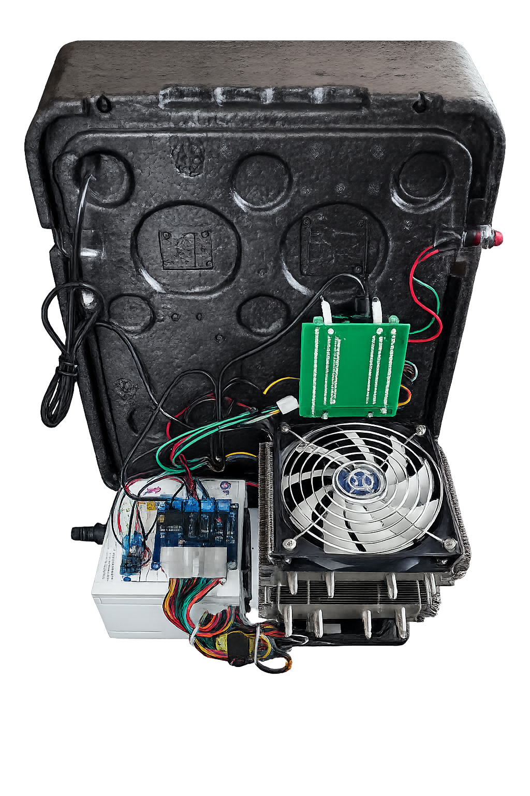
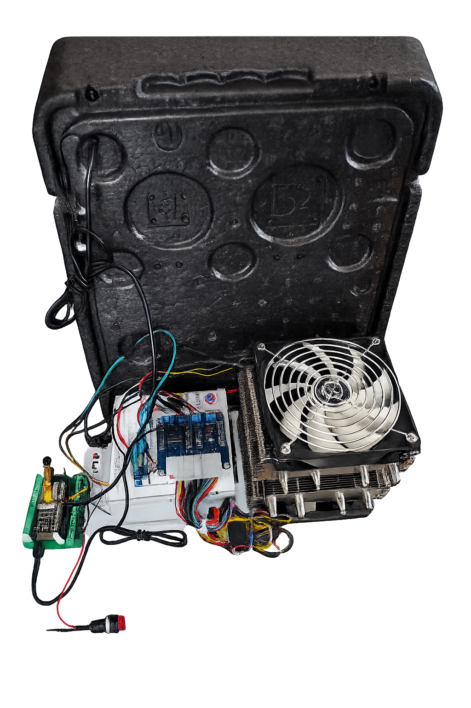
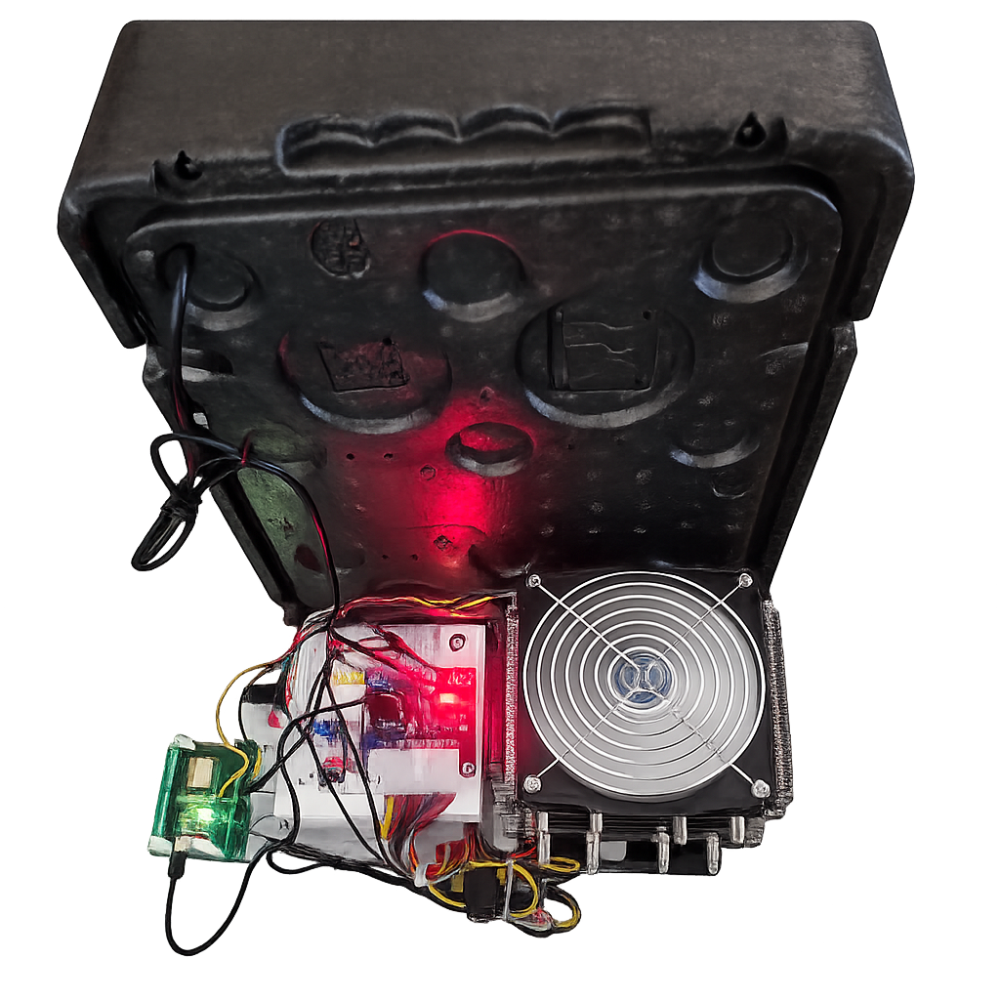
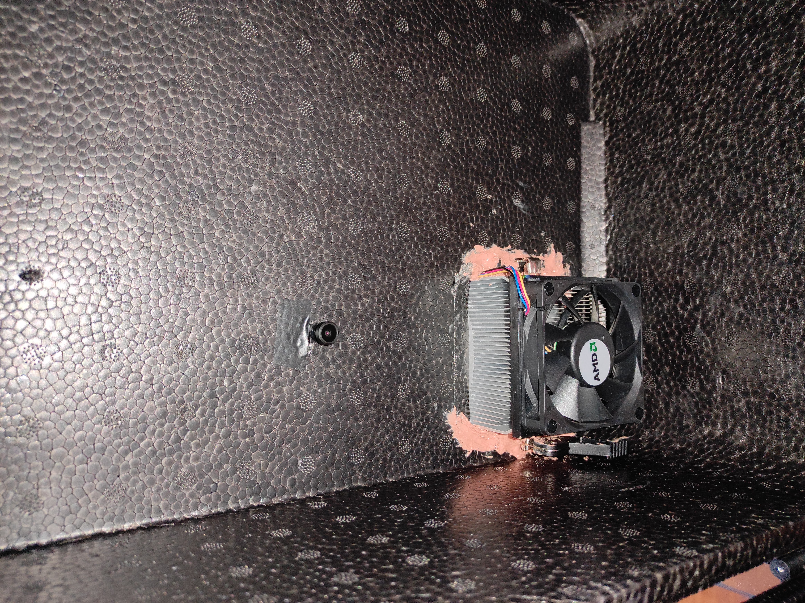

# 🍷 AI Smart Humidor

> Inteligentní termoelektrické chladicí zařízení s AI kamerou postavené na ESP32-S3, řízené přes Home Assistant

## 📖 Popis Projektu

### Čeština
AI Smart Humidor je **inteligentní chladicí box** s kapacitou pro dvě láhve vína, zkonstruovaný z izolačního XPS boxu a chladicího systému. Systém využívá **Peltierův článek** v ko[...]

### English
The **AI Smart Humidor** is an intelligent cooling box designed for wine bottle storage, constructed from high-insulation XPS foam. The system employs a **Peltier element** paired with active CPU [...]

---

## 📸 Galerie Projektu

### Schéma Zapojení


### Hardware a Montáž





### Fotodokumentace


---

## ⚙️ Hardwarová Specifikace

| Komponenta | Popis |
|-----------|-------|
| **Mikrokontroler** | GOOUUU ESP32-S3-CAM V1.3 |
| **Kamera** | OV2640 (pro AI analýzu) |
| **Teplotní senzor** | DS18B20 / MY18E20 (1-Wire) |
| **Chlazení** | Peltierův článek + 2× CPU chladič (vnitřní/vnější okruh) |
| **Napájení** | ATX zdroj (12V/5V s breakout boardem) |
| **Indikace** | Adresovatelná RGB LED (WS2812B) - GPIO48 |
| **Vstupy** | Fyzické tlačítko pro spuštění analýzy |

---

## 🚀 Instalace a Konfigurace

### 1. ESPHome Setup
```yaml
# V Home Assistantovi:
1. Vytvořte novou instanci ESPHome
2. Vložte obsah esphome_config.yaml
3. Proveďte first flash na zařízení
```

### 2. Identifikace Senzoru
⚠️ **Důležité:** V souboru `esphome_config.yaml` musíte změnit adresu senzoru:
```yaml
# Nalezněte řádek:
address: 0x650b24a17f7ae128  # ← ZMĚŇTE NA VAŠE ID

# Postup:
# 1. Zapněte zařízení a podívejte se do logu ESPHome
# 2. Najděte vaše ID ve výstupu "1-Wire devices found"
# 3. Zkopírujte a vložte do konfigurace
```

### 3. API Zabezpečení
V sekci `api:` nastavte vlastní šifrovací klíč:
```yaml
api:
  encryption:
    key: "YOUR_UNIQUE_KEY_HERE"
```

### 4. Teplotní Regulátor
PI regulátor používá optimalizované parametry:
```python
Kp: 0.08    # Proporcionální zisk
Ki: 0.003   # Integrální zisk
alpha: 0.35 # Filtr
```
⚠️ Měňte pouze s hlubší znalostí termodynamiky vašeho systému

### 5. Home Assistant Konfigurace

**Krok 1:** Přidejte do `configuration.yaml`:
```yaml
# Vložte obsah: ha_configuration.yaml
```

**Krok 2:** Přidejte automatizace do `automations.yaml`:
```yaml
# Vložte obsah: ha_automation.yaml
# Vložte obsah: ha_led_logic.yaml
```

### 6. AI Provider Nastavení
Nahraďte v `ha_automation.yaml`:
```yaml
# Najděte: "<VAŠE_PROVIDER_ID>"
# Nahraďte skutečným ID z vaší LLM Vision integrace

# Kde najít ID:
# → Home Assistant → Vývojářské nástroje → Akce
# → llmvision.image_analyze
```

---

## 📁 Struktura Projektu

```
humidor/
├── README.md                    # Tento soubor
├── esphome_config.yaml          # Konfigurace ESP32-S3
├── ha_configuration.yaml        # Home Assistant entity definice
├── ha_automation.yaml           # Automation a AI logika
├── ha_led_logic.yaml            # LED indikace logika
├── images/                      # 📸 Fotky a schémata projektu
│   ├── schema-cor.jpg           # Schéma zapojení (opraveno)
│   ├── engine-unit.png          # Chladicí jednotka
│   ├── hbf.png                  # Hardware komponenty
│   ├── hbf1.png                 # Detail 1
│   ├── hbf2.png                 # Detail 2
│   └── IMG_20260618_154138.jpg  # Finální projekt
└── LICENSE                      # MIT License
```

---

## 🔧 Postup První Spuštění

1. **Hardware montáž** → Zapojte všechny komponenty dle schématu
2. **ESP32 firmware** → Flashněte ESPHome konfiguraci
3. **Home Assistant** → Přidejte konfigurační soubory
4. **Senzor ID** → Najděte a nastavte 1-Wire adresu
5. **AI Provider** → Připojte LLM Vision integraci
6. **Testování** → Vyzkoušejte analýzu přes tlačítko

---

## 💡 Charakteristiky

- ✅ **Přesná teplotní kontrola** - PI regulátor s přizpůsobeným algoritmen
- ✅ **AI Vision** - OV2640 kamera pro analýzu obsahu
- ✅ **Smart Integration** - Plná integrace s Home Assistant
- ✅ **Low Power** - Efektivní chlazení s Peltierovým prvkem
- ✅ **Open Source** - MIT License, plně otevřený kód

---

## 📝 Licence

Projekt je vydán pod [License](LICENSE).

---

## 🤝 Přispívání

Chcete přispět? Podívejte se na [CONTRIBUTING.md](CONTRIBUTING.md) pro více informací.

---

**Vytvořeno:** 2026  
**Status:** 🟢 Aktivní vývoj
